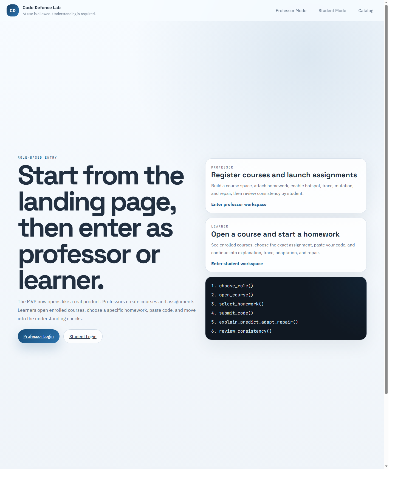

# Code Defense Lab MVP

Role-based assessment prototype for code comprehension in the age of AI-assisted programming.



**Live demo:** [educatian.github.io/code-defense-lab-mvp](https://educatian.github.io/code-defense-lab-mvp/)  
**Repository:** [github.com/Educatian/code-defense-lab-mvp](https://github.com/Educatian/code-defense-lab-mvp)

## Overview

Code Defense Lab is a front-end MVP for a learning experience where students are allowed to use AI, but must still defend their understanding.

Instead of stopping at code submission, the product walks learners through a sequence of understanding checkpoints:

1. Submission
2. Hotspot Review
3. Trace Mode
4. Mutation Task
5. Repair Mode
6. Results

On the instructor side, the prototype supports course creation, assignment setup, module toggles, review queues, and student detail views designed around evidence of understanding rather than output alone.

## What This Prototype Demonstrates

- Role-based landing experience for professors and learners
- Course-first student flow
- Assignment builder for instructors
- Multi-step assessment pipeline
- Rubric-style result summaries
- Review queue and student detail review for instructors
- Language-aware assignments for both `Python` and `R`
- Persistent local demo state using `localStorage`

## Core Product Idea

The MVP is built around a simple principle:

> AI use is allowed. Understanding is required.

That idea shapes the full learner journey:

- Students choose an enrolled course
- Open a specific homework
- Submit code with provenance context
- Defend reasoning through multiple checkpoints
- Receive a structured result summary

It also shapes the instructor journey:

- Create courses
- Publish assignments
- Configure which checkpoints are enabled
- Review learner consistency
- Decide whether follow-up or oral defense is needed

## User Flows

### Learner flow

- Landing page
- Student portal
- Course selection
- Homework selection
- Code submission
- Hotspot explanation
- Trace reasoning
- Mutation response
- Repair response
- Results

### Instructor flow

- Landing page
- Professor dashboard
- Course registration
- Assignment creation
- Module configuration
- Review queue
- Student detail review

## Supported Assessment Languages

The current MVP supports:

- `Python 3.11`
- `R 4.3`

Assignments adapt file naming and runtime labels based on the selected language.

## Screens Included

The repository currently includes these main views:

- `index.html` - role-based landing page
- `pages/student-portal.html`
- `pages/student-submission.html`
- `pages/hotspot-questions.html`
- `pages/trace-mode-task.html`
- `pages/mutation-task.html`
- `pages/repair-mode-task.html`
- `pages/student-result.html`
- `pages/professor-dashboard.html`
- `pages/create-assignment.html`
- `pages/professor-student-detail.html`
- `catalog.html` - internal view index for exploration

## Tech Stack

- `Vite`
- `HTML`
- `CSS`
- `Vanilla JavaScript`
- `GitHub Pages`

## State Model

This MVP is front-end only.

There is no backend or database yet. Demo behavior is powered by shared browser state stored in `localStorage`, mainly through:

- `src/workspace-state.js`
- `src/shell.js`

This allows the prototype to simulate:

- course creation
- assignment publishing
- learner progress
- review queue data
- rubric-style result generation

## Local Development

### Prerequisites

- Node.js 18+
- npm

### Install

```bash
npm install
```

### Start the dev server

```bash
npm run dev
```

### Build for production

```bash
npm run build
```

### Preview the production build

```bash
npm run preview
```

## Project Structure

```text
code-defense-lab-mvp/
|-- pages/                 # Multi-page product views
|-- src/                   # Shared shell and state logic
|-- dist/                  # Production build output
|-- .github/workflows/     # GitHub Pages deployment workflow
|-- index.html             # Role-based entry page
|-- catalog.html           # Internal page catalog
|-- styles.css             # Shared styling
|-- app.js                 # Landing/catalog behavior
`-- vite.config.js         # Vite configuration
```

## Design Goals

This prototype was designed to feel less like a generic dashboard and more like a guided academic workflow.

Key design goals:

- make student progress feel intentional
- keep assessment steps consistent across pages
- reduce "template switching" between checkpoints
- help instructors review evidence, not just scores
- present AI-assisted work as something to evaluate thoughtfully, not automatically punish

## Current Scope

This repository is an MVP, not a production application.

Included:

- polished front-end flows
- realistic assessment steps
- local persistent state
- GitHub Pages deployment

Not included yet:

- authentication
- database persistence
- LMS integration
- real grading engine
- real file execution or sandboxing
- analytics backend

## Roadmap Ideas

- backend persistence for courses, assignments, and attempts
- real student records and multi-user review queues
- richer rubric engine tied to learner inputs
- execution sandbox for submitted code
- LMS or classroom platform integrations
- instructor analytics and cohort-level reporting

## Deployment

The site is deployed with GitHub Pages.

Production URL:

- [https://educatian.github.io/code-defense-lab-mvp/](https://educatian.github.io/code-defense-lab-mvp/)

## Why This Repository Matters

Code Defense Lab explores a practical question many educators now face:

How do we preserve rigor when code generation is easy?

This MVP proposes one answer:

Assess the learner's ability to explain, trace, adapt, and repair the logic they submit.

## License

No license has been added yet. If this repository is intended for public reuse, add a license before wider distribution.
