# Code Defense Lab

> **AI use is allowed. Understanding is required.**

Code Defense Lab is a 6-checkpoint assessment prototype for the AI-assisted programming era. Students submit code (often AI-assisted), then *defend* their understanding through explain → predict → adapt → fix → reflect. The full R execution stack runs **in the student's browser** via WebAssembly — no servers, no per-student execution costs.

**Live demo:** [educatian.github.io/code-defense-lab-mvp](https://educatian.github.io/code-defense-lab-mvp/) · **Repo:** [github.com/Educatian/code-defense-lab-mvp](https://github.com/Educatian/code-defense-lab-mvp)

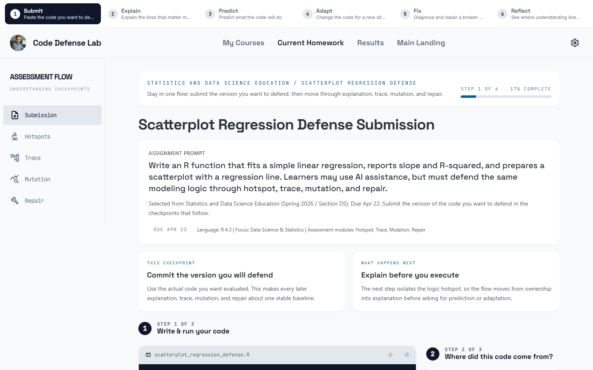

---

## What it is

Six plain-language checkpoints, each a separate page, anchored by a journey strip that's visible on every step:

| # | Student-facing label | What the learner does |
|---|---|---|
| 1 | **Submit** | Paste / write the code they want to defend, run it in-browser, optionally describe how they built it |
| 2 | **Explain** | Answer 3 hotspot questions about the lines that control the outcome |
| 3 | **Predict** | Mentally simulate execution on a small input *before* running anything |
| 4 | **Adapt** | Modify their own code to handle a new constraint, then run to verify |
| 5 | **Fix** | Diagnose a deliberately broken variant and apply the smallest correct fix |
| 6 | **Reflect** | Read a consistency report — what lined up, what didn't, and the suggested next action |

Internal Bloom × SOLO × DOK mapping for each checkpoint lives in [`docs/learning-design/01-learning-objectives.md`](docs/learning-design/01-learning-objectives.md). Students never see the taxonomy in the UI — only the plain verbs above.

---

## Screenshot tour

### Student journey

| | |
|---|---|
| **1. Submit** — code editor + Run button + output panel; runs R in the browser via WebR. | **2. Explain** — three hotspot questions on the lines that anchor the modeling claim. |
|  | 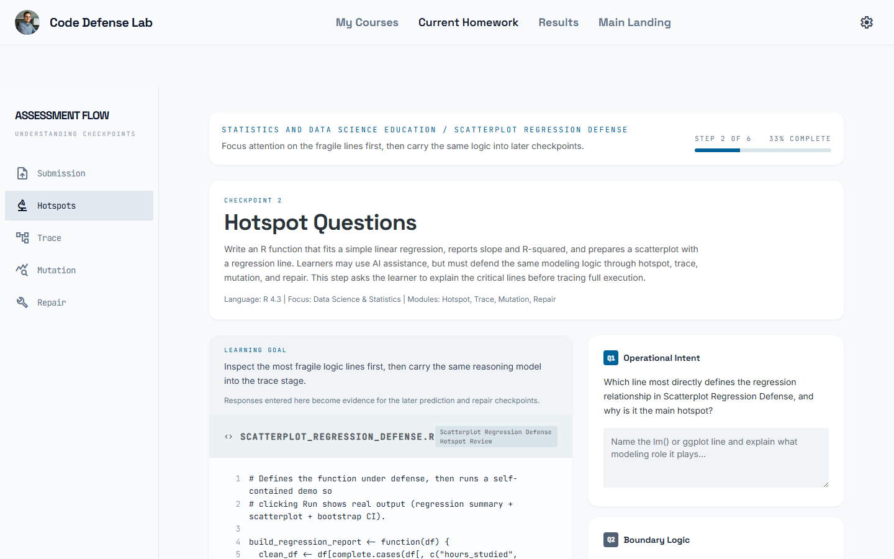 |
| **3. Predict** — predict variable state at three points without running the code. | **4. Adapt** — the learner's own submitted code, edit it for a new constraint, Run to verify. |
| 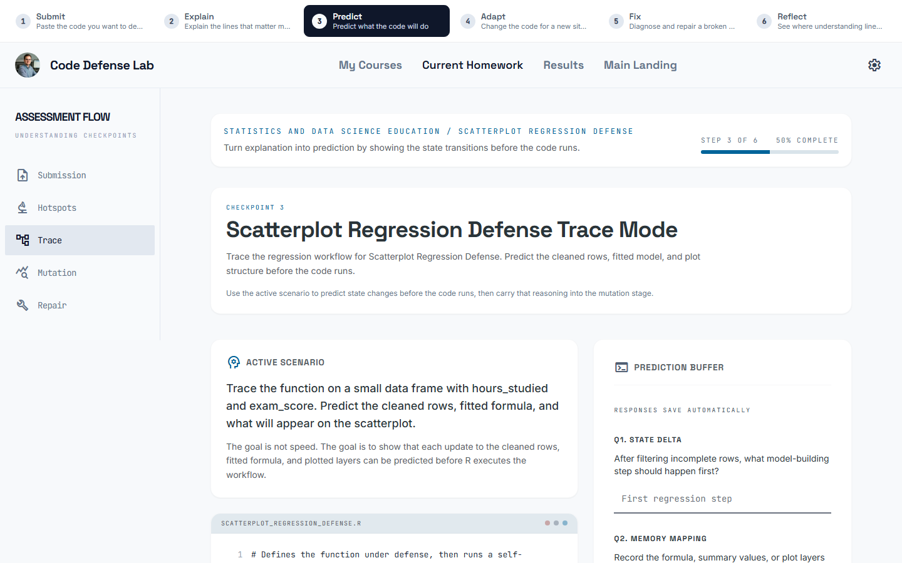 | 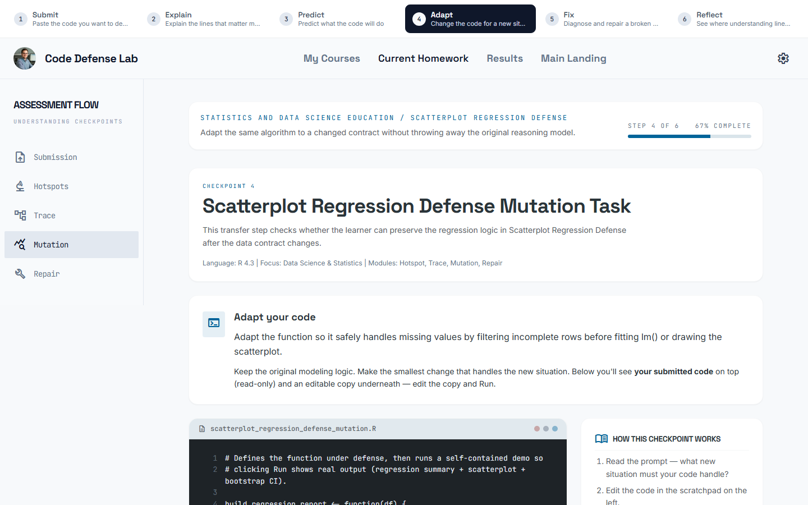 |
| **5. Fix** — diagnose a deliberately broken variant, fix it minimally, Run hidden tests. | **6. Reflect (fresh)** — Next Action card guides the learner to the next pending step. |
| 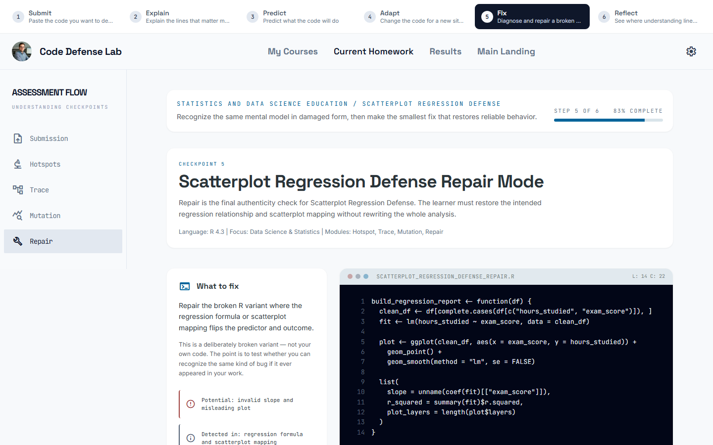 | 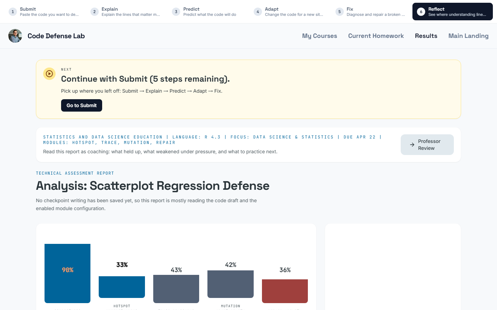 |
| **6. Reflect (completed, low consistency)** — `mailto:` button pre-fills an oral-defense request. | **Landing** — single role chooser. |
| 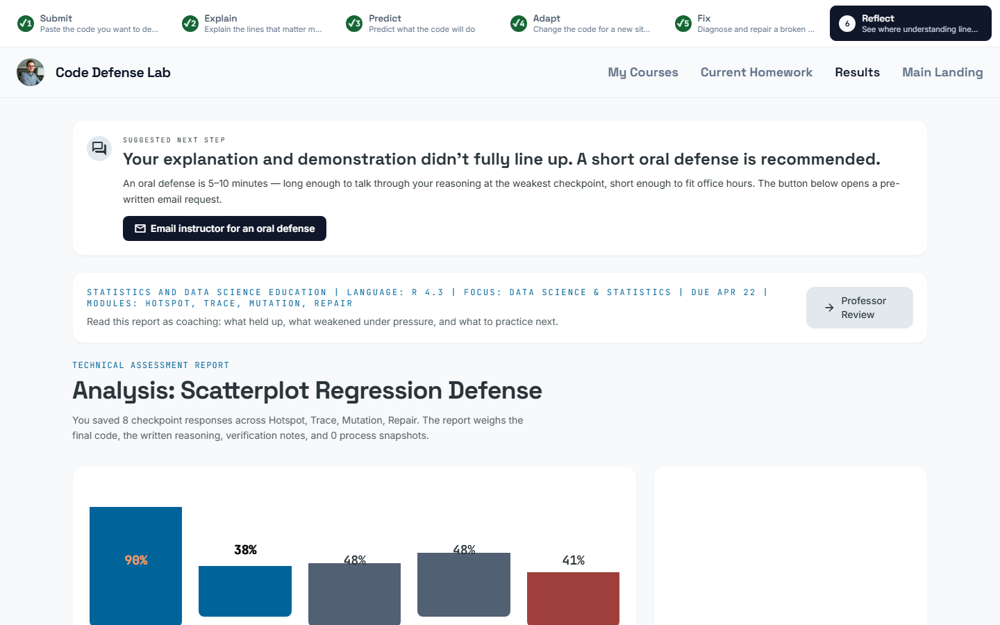 | 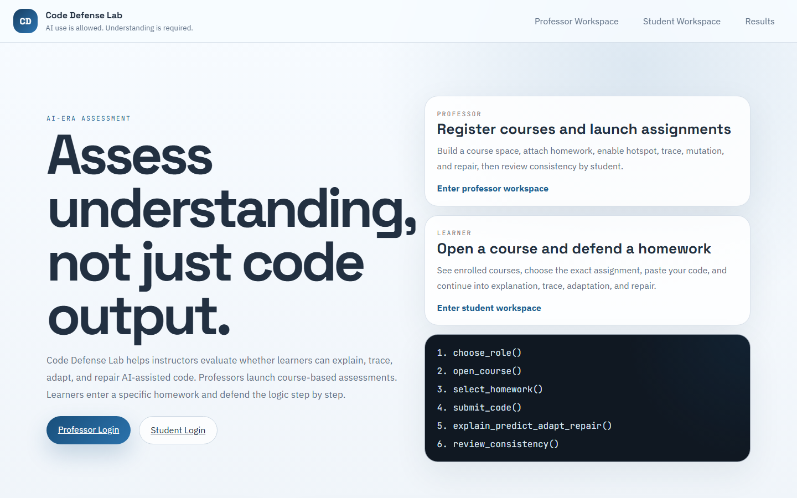 |

### Instructor journey

| | |
|---|---|
| **Professor dashboard** — courses, instructor-contact form, review queue. | **Detailed assignment builder** — language-aware (R / Python), per-checkpoint module toggles. |
| 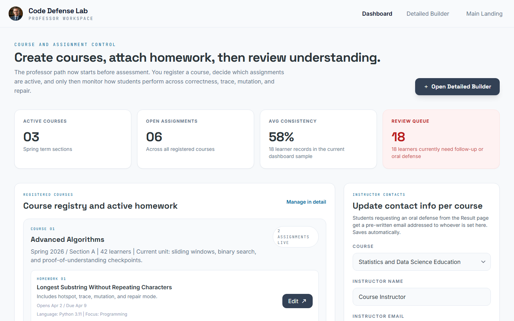 | 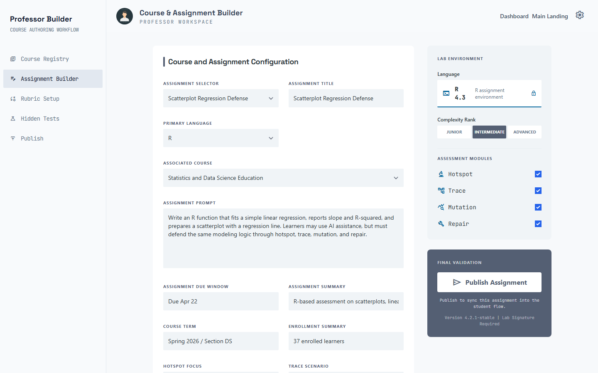 |
| **Student detail** — instructor reads each defense in one place. | **Student portal** — course-first, then homework. |
| 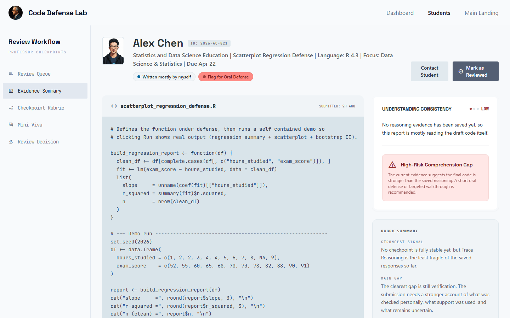 | 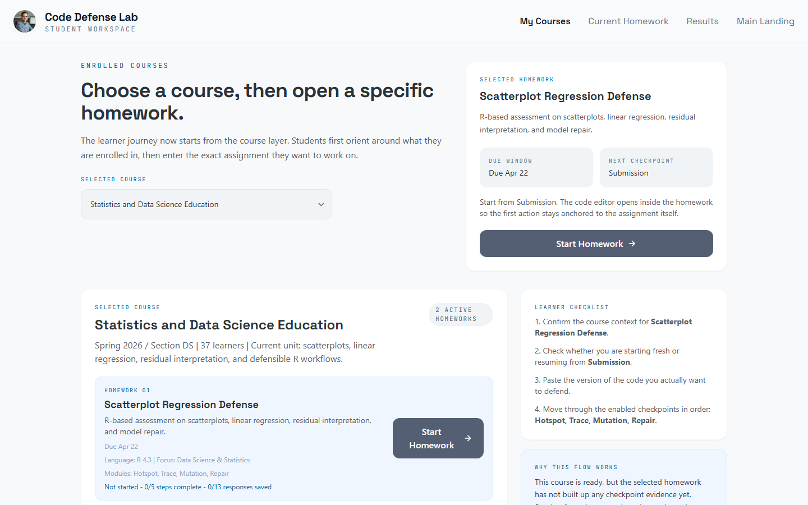 |

Re-capture all screenshots after UI changes:

```bash
npm run capture:screenshots
```

---

## R in the browser — how the runtime works

The headline student capability is **paste R → click Run → get scatterplot + regression output + simulation results, in-browser, with no backend.**

The default seed code on the Submit page demonstrates exactly this — a `build_regression_report()` function plus a self-contained demo that fits a regression, prints slope / R² / n, draws a scatterplot with a regression line, and runs a 1,000-iteration bootstrap CI. First Run boots WebR (~10–30 s); subsequent runs are fast.

```
src/runtime/
├── index.js           Public API: runCode({ language, code, onStdout, onStderr, onPlot, timeoutMs })
├── webrAdapter.js     Loads WebR 0.5.4 from CDN, opens an SVG device, captures
│                      stdout/stderr/plots; uses ChannelType.PostMessage so it
│                      works on plain static hosts (no COOP/COEP needed).
├── pyodideAdapter.js  Stub — Python parity ready to enable once Pyodide is
│                      self-hosted under /public/pyodide/.
├── ui.js              attachRunner({ codeEl, mountEl, getLanguage, onResult }):
│                      Run button + console (role="log" aria-live) + plot panel.
│                      Ctrl/⌘+Enter to run; aria-keyshortcuts wired.
└── runner.css         Scoped .cdl-runner styles + reduced-motion handling.
```

The same runtime mounts on Submit, Adapt, and Fix pages with each page's own seed code (Adapt seeds with the learner's own submission so they adapt their work, not a template).

---

## Architecture

```
code-defense-lab/
├── pages/                      # 11 multi-page student + instructor views
├── src/
│   ├── runtime/                # WebR / (Pyodide stub) — see above
│   ├── journey/                # Single source of truth for the 6-step UI labels
│   │   ├── journey.js          # JOURNEY array + mountJourneyStrip()
│   │   └── journey.css         # Strip + step heading + disclosure styles
│   ├── workspace-state.js      # All state, persistence, render functions
│   ├── supabase-state.js       # Optional remote sync (read warning header inside)
│   └── shell.js                # Catalog page (developer-only)
├── tests/
│   ├── e2e/                    # 19 Playwright specs (student + professor + sync + runtime)
│   └── screenshots/            # README screenshot capture spec
├── supabase/
│   ├── README.md               # Two-DB separation explained
│   ├── workspace_states.sql    # Legacy demo table (already deployed)
│   └── migrations/
│       ├── 0002_workspace_states_per_owner_rls.sql   # NEEDS APPROVAL
│       ├── 0003_commercial_schema.sql                # NEEDS APPROVAL
│       └── research/0001_research_schema.sql         # NEEDS APPROVAL — separate project
├── commercial/                 # Next.js scaffold for the future SaaS — see commercial/README.md
├── docs/
│   ├── screenshots/            # PNGs used by this README
│   ├── learning-design/        # Internal LO matrix + LXD cycle notes
│   └── commercialization/      # Phase audit + punch list
├── playwright.config.js        # E2E suite config (testDir: tests/e2e)
└── playwright.screenshots.config.js   # Screenshot capture config (testDir: tests/screenshots)
```

The root MVP is the focus. The `commercial/` Next.js scaffold (Anthropic agents, Drizzle schema, Stripe-ready) is intentionally deprioritized — see [`commercial/README.md`](commercial/README.md).

---

## Local development

Requires Node 20+ (pinned in `.nvmrc`).

```bash
npm install                  # one-time
npm run dev                  # Vite dev server on http://127.0.0.1:4173
npm run build                # production build to dist/
npm run preview              # serve the production build
```

### End-to-end tests (Playwright + Chromium)

```bash
npx playwright install chromium       # one-time
npm run test:e2e                      # 19 specs, ~30 s
npm run test:e2e:headed               # watch the browser
```

Suites:
- `tests/e2e/student-flow.spec.js` — 9 specs: every checkpoint loads with active journey strip, seed code visible, aria-labelledby wired, Trace SSR fallback safe, no fake "Technical Log".
- `tests/e2e/professor-flow.spec.js` — 3 specs: dashboard seeds, instructor contacts auto-save and survive reload, Quick-Register creates a new course.
- `tests/e2e/sync.spec.js` — 3 specs: student answers flow into the professor detail view; instructor email flows into the student `mailto:` link.
- `tests/e2e/runtime-smoke.spec.js` — 1 spec (180 s timeout): WebR Run completes (success or surfaced error, never a silent hang).

### Screenshot capture

```bash
npm run capture:screenshots          # writes docs/screenshots/*.png
```

Add new pages to [`tests/screenshots/capture.spec.js`](tests/screenshots/capture.spec.js) and re-run.

---

## Learning experience design

The LXD cycle is documented and intentionally kept *internal* — students never see Bloom's / SOLO / DOK terminology in the UI.

- [`docs/learning-design/01-learning-objectives.md`](docs/learning-design/01-learning-objectives.md) — per-checkpoint Bloom × SOLO × DOK matrix, evidence collected, validity-gap notes, construct-validity verdict.
- [`docs/learning-design/02-lxd-cycle.md`](docs/learning-design/02-lxd-cycle.md) — what was found in cycle 1 (WCAG 2.2 AA + Nielsen + CLT), what was fixed (journey strip, plain language, removed fake "Technical Log", aria-live runner output, prefers-reduced-motion, etc.), what is deferred for cycle 2.

The plain-language journey labels (Submit / Explain / Predict / Adapt / Fix / Reflect) live in **one** file: [`src/journey/journey.js`](src/journey/journey.js). Renaming any stage is a single-file change; the strip on every page reads from the same array.

---

## Optional: Supabase remote sync

The MVP runs end-to-end with **just localStorage** — no Supabase needed. A read-only demo sync is included for cross-device showcasing only.

⚠️  **Multi-tenant warning** lives at the top of [`src/supabase-state.js`](src/supabase-state.js): every visitor of a vanilla deployment writes to the same shared row. The fix is queued as additive-only migrations under `supabase/migrations/`:

```bash
# Commercial Supabase project (instructor-facing, FERPA-audited)
supabase db push --project-ref <commercial-project-ref> \
  --include supabase/migrations/0002_workspace_states_per_owner_rls.sql \
  --include supabase/migrations/0003_commercial_schema.sql

# Research Supabase project (separate project, anonymized only)
supabase db push --project-ref <research-project-ref> \
  --include supabase/migrations/research/0001_research_schema.sql
```

Per project rule (additive-only DDL, no destructive ALTER), the migration files exist but **must be applied manually** — see [`supabase/README.md`](supabase/README.md).

---

## Deployment

GitHub Pages: [`https://educatian.github.io/code-defense-lab-mvp/`](https://educatian.github.io/code-defense-lab-mvp/) — auto-deploys from `master` via [`.github/workflows/deploy-pages.yml`](.github/workflows/deploy-pages.yml). The PR-time CI workflow ([`.github/workflows/ci.yml`](.github/workflows/ci.yml)) runs MVP build + commercial typecheck + commercial build + gitleaks secret scan.

---

## What's intentionally NOT in this MVP

- **Authentication.** Single-tenant demo. Auth lands with the multi-tenant migration above.
- **Server-side code execution.** All execution is client-side WebAssembly, by design — keeps per-student exec cost = $0 and code never leaves the browser.
- **LMS integration / SSO / SAML.** Out of scope until Phase 3+ (post-B2C launch).
- **Real grading engine.** The result page heuristically scores from response coverage; the agent fleet in `commercial/src/lib/agents/` is the future grader.

---

## Why this repository matters

The question every CS instructor now faces: *how do we preserve rigor when code generation is easy?*

This MVP proposes one answer that's grounded in instructional design: **assess the learner's ability to explain, trace, adapt, and repair the logic they submit.** Make AI use part of the disclosure (Step 1), then test understanding through artifacts the AI cannot produce on the learner's behalf (Steps 2–5).

---

## Maintainer

Dr. Jewoong Moon · ADDIE Lab · College of Education, University of Alabama. Issues and PRs welcome — see [`.github/SECURITY.md`](.github/SECURITY.md) for vulnerability disclosure.

## License

[MIT](LICENSE).
